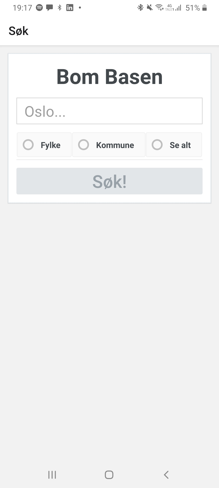
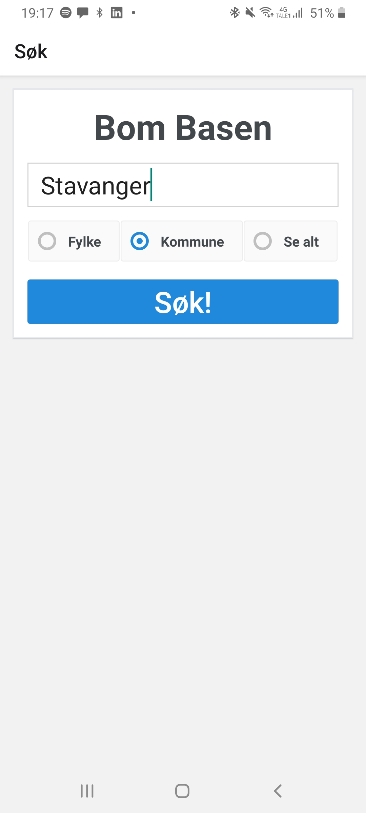
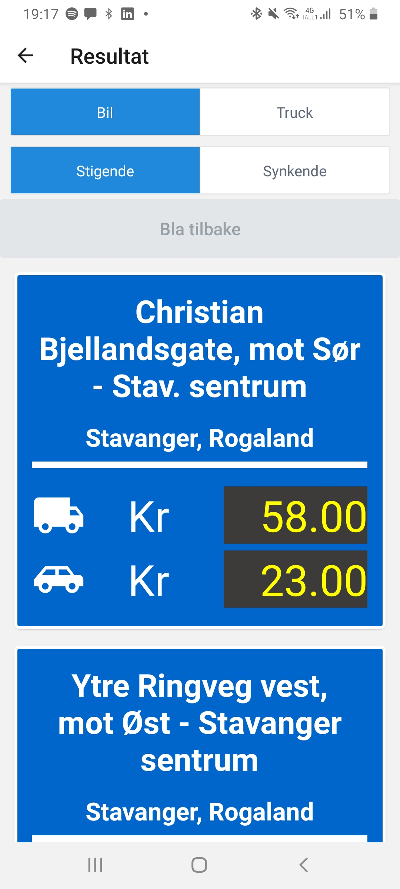
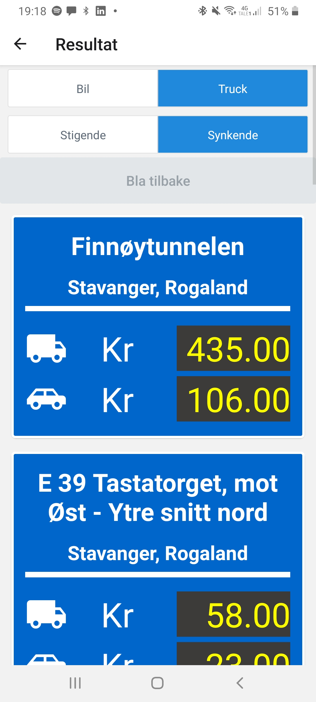
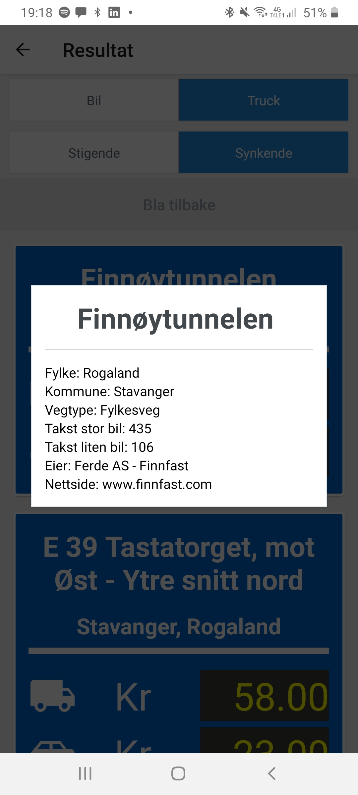
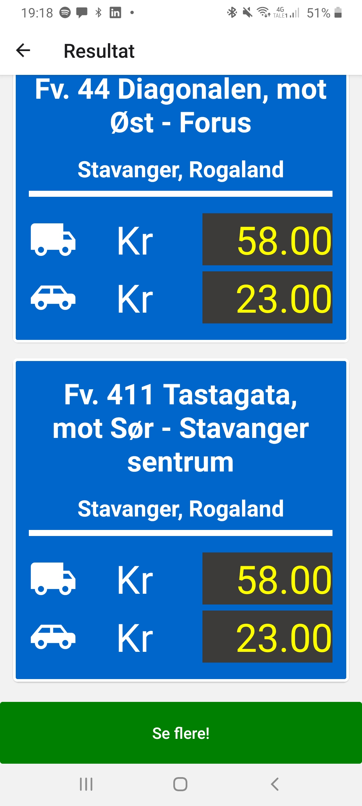
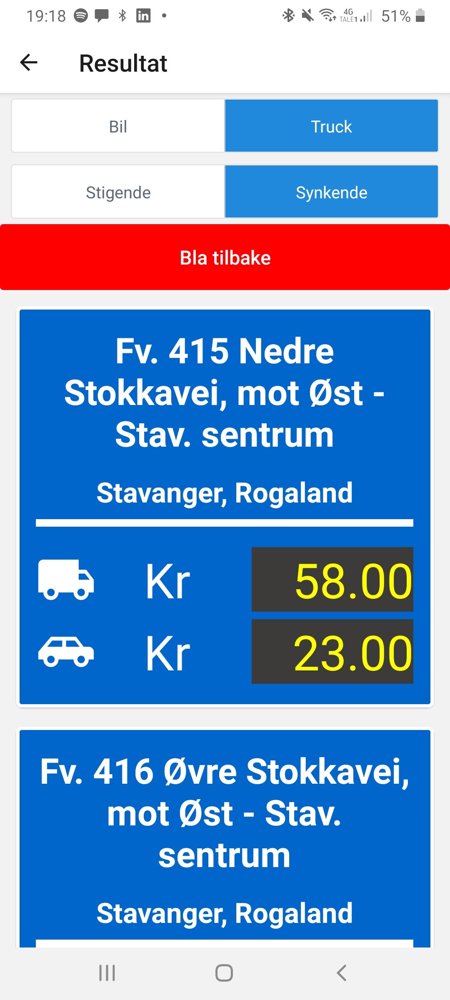

# Dokumentasjon - Prosjekt 4

## Hvordan å kjøre prosjektet

**NB! For å kjøre prosjektet, så må du sørge for at du har expo installert.**

1. klon prosjektet fra Gitlab

   - SSH:  
     `git clone git@gitlab.stud.idi.ntnu.no:it2810-h20/team-00/p4-14/prosjekt-4-lettmelk.git`
   - HTTPS:  
     `git clone https://gitlab.stud.idi.ntnu.no/it2810-h20/team-00/p4-14/prosjekt-4-lettmelk.git`

2. gå inn i client mappen til prosjektet  
   `cd prosjekt-4-lettmelk/client`
3. kjør npm install 
   `npm install`
4. Start expo  
   `expo start`
5. Kjør som normalt!

Du trenger ikke å sette opp noe backend, da denne kjøres på NTNU sine VM'er. Om applikasjonen ikke skulle fungere optimalt (E.g at dataen ikke lastes) så kan man prøve å kjøre det med VPN koblet til NTNU. Om du har trøbbel med å kjøre prosjektet på egen mobil, så anbefaler jeg fra egen erfaring å kjøre expo med tunnel mode.

## Hva er egentlig dette prosjektet?

Kort forklart, så er dette en frontend bomstasjonssøkemotor skrevet med React Native. Den lar deg søke på bomstasjoner, basert på et par parametere. Man kan deretter scrolle gjennom dem. De kan også sorteres etter taksttype, både stigende og synkende. Det er også mulig å se mer om en bomstasjon med å trykke på en av bomkortene. Dette vil vise et modalvindu med litt ekstra informasjon, som nettside og eieren av bomstasjonen. 

## Innhold of funksjonalitet

### Oppsett

Mesteparten av koden ligger under `client/components`. Der ligger SearchBox og Resultdisplay komponentene, som representerer hver sin side til applikasjonen. Der finnes også BomCard.tsx som representerer et dataobjekt i ResultsDisplay. Der ligger også to mapper, state og helpers. Inni state ligger Redux staten som komponentene benytter. I helpers finnes query.tsx som holder hjelpefunksjoner som gir GraphQl spørringer, i tilegg til filen types.tsx som definerer typescript typer. Merk at også App.tsx i Client-mappa er modifisert for å ha Apollo og Redux state, samt sette opp React Navigation.

### Søkemotor (SearchBox)

Søkemotoren er komponentet SearchBox, som består av et inputfelt, 3 checkbokser og en knapp. Når brukeren interagerer med inputfeltet, eller checkboksene, så lagres dette i en Redux slice. Det er først når brukeren trykker submitt, at han blir tatt til en resultatsiden. Jeg valgte å splitte søkesiden fra resultatsiden, ettersom det ga meg en god grunn til å lære mer om react navigation.

### Resultatsiden (ResultDisplay)

Resultatsiden leser fra Redux staten og kaller en GraphQL spørring med en Apollo client. Resultatet fra spørringen lastes som BomCard komponenter som vises i en scrollview. Dataen til disse komponentene lastes dynamisk ned i grupper på 10 og 10. Om man scroller neders vil man kunne trykke seg til neste side, gitt det er flere resultater.

### Rafinering av resultat

Øverst på resultatsiden vil man finne to knappegrupper. Disse lar deg sortere bomstasjonene basert på taksttype og om den er stigende eller synkende. Rafineringen vil utføre en ny spørring med Apollo, ettersom jeg ikke så noen god måte å implementere dette på uten å fjerne dynamisk nedlasting. Tanken er at man ville måtte hente hele resultatsettet før det er nyttig å rafinere det (f.eks sortering). Merk at tidligere spørringer blir lagret i cache av Apollo, og vil kunne lastes inn uten å måtte utføre en ny spørring til serveren. Det kreves med andre ord ingen ekstra lasting å utføre en sortering som er gjort tidligere.

### Teknologier

Prosjektet er skrevet utelukket med typescript, hvor expo init er brukt for å sette opp prosjektet.

#### liste over biblioteker

- Komponenter
  - React Native elemets
  - React Native modal
- Navigasjon
  - React Navigation
- State
  - Redux (m/ toolkit)
  - Apollo Client (for caching)
- Graphql
  - Apollo Client

Jeg prøvde først å finne ferdiglagde komponenter for å raskere kunne utvikle siden. Noen ganger måtte jeg bruke de vanlige React Native komponentene, som inputfield, ettersom alternativene var for tungvint å style og assosieres med annen bruk. Jeg fant i midlertid en stor fordel med eksterne komponenter, nemlig at de jeg brukte var like på både IOS og Android. I kontrast til noen komponenter som f.eks React Native buttons, som bare viste en klikkbar tekst framfor en knapp når jeg testet på en Iphone 8.

React Native modal gjorde det lett å sette opp en modal popup. En ulempe er at den ødelegger layouten på webversjonen av applikasjonen

React navigation ble brukt for å implementere en applikasjon med flere siden som man kunne navigere mellom.  

Redux ble brukt til å lagre søkestaten, ettersom jeg ville bruke den på to forskjellige sider, som ellers ville gjort det kronglete. Dette gjorde det lett å flytte stat, og vil også gjøre det enkelt å bygge på appen om jeg skulle ønske ting som sorteringsknappene i et annet vindu.

Jeg valgte å bruke Apollo, ettersom den ble beskrevet som lettvint å sette opp med minimal konfigurasjon. I tillegg sørger den for automatisk caching og tilrettelegger for pagination.

### Testing

Utviklingen har for det meste foregått med en Android mobil, men jeg fikk også muligheten til å teste funksjonalitetetn på Iphone. I tillegg til å klikke gjennom alt av funksjonalitet som jeg har lagt til, så lagde jeg også en mer formel manuell test, som er illustrert i bunnen av under med bilder.

#### Ende til ende test

Dette er en test som går over hovedfunskjonene og sjekker at det ser ut til å stemme.

Målet er å finne eieren av den dyreste bommstasjonen for trucker i Stavanger kommune (finnøytunnellen). Derretter blar man en side frem og en tilbake, og ser at man er på samme plass. Bildene illustrerer resutatet etter å ha utført oppgaven.

0. Åpne siden  
   
1. Skriver Stavanger i Søkefeltet og huker av kommune  
   
2. Trykker på "Søk!" knappen  
   
3. Trykker på "Truck" og "Synkende"  
   
4. Klikke på det første bomkortet, se natnet til eieren.  
   
6. Klikke ut av modalen  
   
7. Scroll nederst og klikk neste side. Se at man er øverst, og ser på den 11 dyreste bommen.  
   
8. Trykk tilbake. Se at man er tilbake til steg 5  
   

  Som sett i bildene, så fungerer alle testene som forventet.   

  Denne testen ble utført både på en Android (samsung A70) og en Iphone 8. Da oppdaget jeg at knappene fra react native ikke var like på begge enhetene, som gjorde at jeg benyttet meg mer av React Native Elements, som sørget for en likhet mellom systemene. Jeg håper alt fungerer like likt hos deg:)

